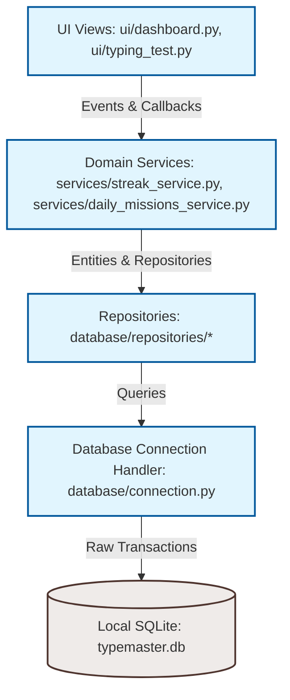

# Tezyoz (TypeMaster)

[](https://opensource.org/licenses/MIT)
[](https://python.org)
[](https://microsoft.com)

**Tezyoz (TypeMaster)** is a professional, 100% offline desktop typing trainer desktop application designed for Windows platforms. Inspired by the clean, minimal aesthetic of Monkeytype (Sokin Neon style), Tezyoz is built as a self-contained productivity tool that tracks long-term performance improvements, XP-based gamification, daily missions, and local statistics without requiring cloud sync or internet access.

---

## 🚀 Key Features

*   **Minimalist Typing Engine**: Fluid caret movements, live word highlighting, and real-time validation metrics (WPM, Accuracy, and Consistency standard deviation).
*   **Rich Analytics Dashboard**: Integrated canvas-based visualizations including:
    *   WPM/Accuracy progress line charts.
    *   Practice duration bar charts.
    *   **Interactive Keyboard Heatmap** mapping keypress frequency and error rates to identify weak keys.
*   **Gamification & Leveling**:
    *   Progressive experience points (XP) calculation system.
    *   Visual level ups and interactive progress bars (XP bar and Daily Goal status).
*   **Daily Missions (Kunlik Topshiriqlar)**: Procedurally generated individual challenges updated daily (e.g., target WPM milestones, mistake-free runs) rewarding bonus XP.
*   **Ma'lumotlar Bazasi Zaxirasi (Backup & Restore)**: Transactional SQLite database backup and verification utility directly from the user interface.
*   **Enterprise-Grade Local Security**: Zero-dependency secure password storage relying on PBKDF2-HMAC-SHA256 with 100,000 iterations to withstand brute-force attacks.
*   **Dynamic Theme Propagation**: Fully responsive theme engine switching between `dark`, `light`, and `cyberpunk` modes across all views instantly.
*   **Internationalization (i18n) Engine**: Built-in support for multiple languages (Uzbek and English) propagating preference updates across the entire application instantly.
*   **Persistent Audio Control**: Centralized Sound Service with audio effect switch toggling on-demand sound feedback (clicks and level-up sounds) saved in SQLite user settings.
*   **Enhanced UX & Tables Alignment**: Fine-tuned history tables with right-aligned numeric data columns (WPM, Accuracy, Consistency, and XP milestones) to prevent layout shifting.

---

## 🏗️ Architecture & Component Design

Tezyoz enforces a strict **layered architecture** to ensure separation of concerns, modifiability, and module testability:



### Module Structure

```text
typing/
│
├── app/                  # Application bootstrap and core configs
│   ├── application.py    # Main GUI Window lifecycle and View Router
│   └── config.py         # Centralized configuration tokens and metrics
│
├── database/             # Data access layer
│   ├── connection.py     # SQLite connection manager and transaction context helpers
│   ├── schema.py         # Relational tables definition and database migrator
│   └── repositories/     # Domain data access objects (base, daily stats, path bests)
│
├── services/             # Core business rules & logic
│   ├── auth_service.py   # Security, encryption, and local user sessions
│   ├── streak_service.py # Daily activity calculations
│   ├── daily_missions_service.py # Procedural goal generation
│   ├── i18n_service.py   # Multilingual localization dictionaries and engine
│   └── sound_service.py  # Click/level-up auditory feedback controller
│
├── engine/               # Math core and typing test mechanics
│   ├── calculators.py    # Formulas for WPM, raw speed, consistency, and errors
│   ├── typing_engine.py  # Typing test state machine controller
│   └── text_loader.py    # Static assets parser with resource freeze fallbacks
│
├── ui/                   # CustomTkinter & Tkinter graphical views
│   ├── base.py           # Standard BaseView layout definition
│   ├── dashboard.py      # Main dashboard with statistics, cards, and charts
│   ├── typing_test.py    # Interactive test board canvas
│   ├── settings.py       # Configuration editor (themes, font family/sizes, sound toggle, db backups)
│   └── theme.py          # Centralized themes coloring matrices
│
├── charts/               # Tkinter Custom Canvas visual plotting
│   ├── line_chart.py     # Metrics line graphs with interactive hover tooltips
│   ├── bar_chart.py      # Practice duration bars
│   └── heatmap.py        # Keyboard typing patterns heatmap canvas
│
└── tests/                # Automated verification suites
    ├── test_database.py  # Database transaction assertions
    ├── test_schema.py    # Schema constraints tests
    └── test_auth.py      # Cryptography speed/security bounds
```

---

## 🛠️ Development Setup & Installation

### Prerequisites
*   **Python**: 3.8 or higher.
*   **Operating System**: Windows 8 / 8.1 / 10 / 11.
*   **Dependencies**: Uses the Python Standard Library (Tkinter/ttk, SQLite3, Hashlib) and CustomTkinter for modern aesthetics.

### Setup Instructions

1.  **Clone the repository**:
    ```powershell
    git clone https://github.com/Valijon21/Tezyoz.git
    cd Tezyoz
    ```

2.  **Initialize python virtual environment**:
    ```powershell
    python -m venv .venv
    ```

3.  **Activate virtual environment**:
    *   **PowerShell**:
        ```powershell
        .venv\Scripts\Activate.ps1
        ```
    *   **CMD**:
        ```cmd
        .venv\Scripts\activate.bat
        ```

4.  **Install dependencies**:
    ```powershell
    pip install -r requirements.txt
    ```

---

## 🚦 Verification and Execution

### Running the Desktop Interface
Start up the bootstrapper sequence by executing:
```powershell
python main.py
```

### Running Test Verification Suite
Tezyoz utilizes Python's native `unittest` framework to execute unit tests. You can run all verification checks headlessly:
```powershell
python -m unittest discover -s tests
```

---

## 👥 Muallif va Bog'lanish (Developer & Contacts)

*   **Dasturchi (Developer)**: Valijon Ergashev
*   **Telefon (Phone)**: [+998 (77) 342-33-21](tel:+998773423321)
*   **Loyiha maqvasi**: Tezyoz (TypeMaster) - o'zbek tili lug'atlarining boy majmuasi va gamifikatsiya elementlari bilan birlashtirilgan to'liq oflayn kompyuter trenajyori.

---

## 📄 License
This project is licensed under the MIT License - see the [LICENSE](LICENSE) file for details.
