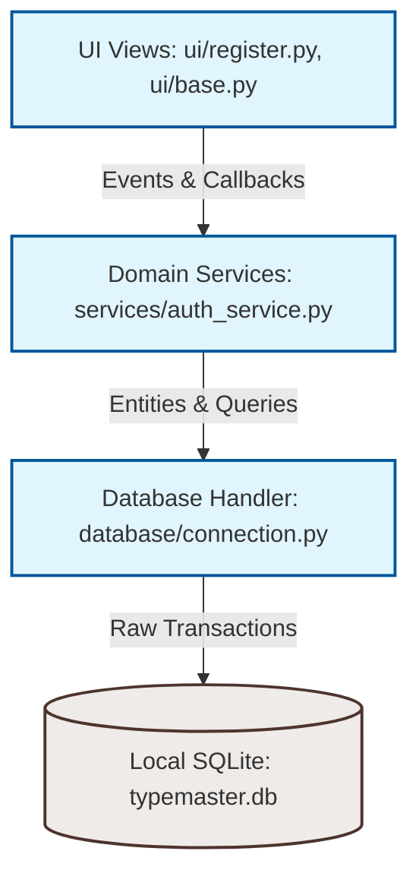

# Tezyoz (TypeMaster)

[](https://opensource.org/licenses/MIT)
[](https://python.org)
[](https://microsoft.com)

**Tezyoz (TypeMaster)** is a professional, 100% offline desktop typing trainer application designed for Windows platforms. Inspired by the clean and minimal aesthetic of Monkeytype, Tezyoz is built as a self-contained productivity tool that tracks long-term performance improvements, XP-based gamification, and local statistics without requiring cloud sync or internet access.

---

## 🚀 Key Features

- **Minimalist Typing Engine**: Fluid caret movements, error tracking, and real-time validation metrics.
- **Robust Persistence Layer**: Local SQLite database storage utilizing dictionary-mapped query structures (`Row` factory) and automatic transaction rollbacks.
- **Enterprise-Grade Client Security**: Zero-dependency secure password storage relying on PBKDF2-HMAC-SHA256 with 100,000 iterations to withstand brute-force attacks.
- **Modern Single-Page UI Manager**: Performance-oriented Tkinter views transition controller handling layout caching and memory-leak prevention.
- **Rigorous Verification Suite**: Headless GUI testing pipelines, connection lifecycle tests, and schema constraint checkups.

---

## 🏗️ Architecture & Philosophy

Tezyoz enforces a strict **layered enterprise architecture** to ensure long-term maintainability, modifiability, and module testability:



### Module Structure
```text
typing/
│
├── app/                  # Application bootstrap and core configs
│   ├── __init__.py
│   ├── application.py    # Main GUI Window lifecycle and View Router
│   └── config.py         # Centralized configuration tokens and metrics
│
├── database/             # Data access layer
│   ├── __init__.py
│   ├── connection.py     # SQLite connection manager and transaction context helpers
│   └── schema.py         # Relational tables definition and DB updates manager
│
├── services/             # Core business rules
│   ├── __init__.py
│   └── auth_service.py   # Security and encryption features
│
├── ui/                   # Desktop user interfaces
│   ├── __init__.py
│   ├── base.py           # Standard BaseView layout class definition
│   └── register.py       # Registration form panels and validations
│
├── tests/                # Automated verification suites
│   ├── __init__.py
│   ├── test_smoke.py     # Central imports compile verification
│   ├── test_database.py  # DB transaction assertions
│   ├── test_schema.py    # Schema constraints tests
│   ├── test_register_ui.py # Headless widgets validation tests
│   └── test_auth.py      # Cryptography speed/security bounds
│
├── logs/                 # Self-contained logging
│   └── app.log           # Non-verbose warnings and critical logs
│
├── data/                 # Relational binary workspace
│   └── typemaster.db     # Current database persistence node
│
├── main.py               # Main application compiler loader entry point
├── requirements.txt      # Lightweight requirements definitions (Standard library focus)
└── .gitignore            # Clean git directories rules
```

---

## 🛠️ Development Setup & Installation

### Requirements
- **Python**: 3.8 or higher.
- **Operating System**: Windows 8 / 8.1 / 10 / 11.
- **Dependencies**: Uses the Python Standard Library (Tkinter/ttk, SQLite3, Hashlib). No external package installs required for local development.

### Step-by-Step Installation

1. **Clone the repository**:
   ```powershell
   git clone https://github.com/Valijon21/Tezyoz.git
   cd Tezyoz
   ```

2. **Initialize python virtual environment**:
   ```powershell
   python -m venv .venv
   ```

3. **Activate the environment**:
   - **PowerShell**:
     ```powershell
     .venv\Scripts\Activate.ps1
     ```
   - **CMD**:
     ```cmd
     .venv\Scripts\activate.bat
     ```

4. **Install necessary dependencies**:
   ```powershell
   pip install -r requirements.txt
   ```

---

## 🚦 Verification and Executions

### Running the Desktop Interface
Start up the bootstrapper sequence by executing:
```powershell
python main.py
```

### Running Test Verification Suite
Tezyoz utilizes Python's native `unittest` framework to execute unit check rules headlessly:
```powershell
python -m unittest discover -s tests
```

---

## 📄 License
This project is licensed under the MIT License - see the LICENSE documentation file for details.
