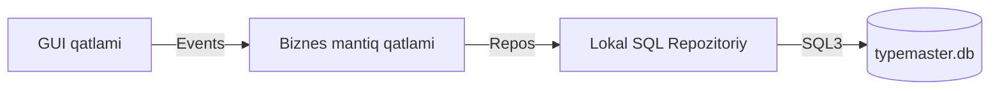

# ⌨️ Tezyoz (TypeMaster)

Windows uchun minimalist, oflayn rejimda ishlovchi professional tez terish trenajyori.

[](https://opensource.org/licenses/MIT)
[](https://python.org)
[](https://microsoft.com)

---

## 💡 Concept & Values

**Tezyoz** – internet aloqasini talab qilmaydigan (100% lokal), Monkeytype dizaynidan andoza olgan kompyuterda tez yozish simulyatoridir. Dastur foydalanuvchining klaviatura mahoratini oshirish, kunlik motivatsiyani ko'taruvchi XP daraja tizimi va batafsil jismoniy klaviatura barmoq yordamchisini taqdim etadi.

---

## ⚡ Asosiy Imkoniyatlar (Key Features)

| Funksiya | Natija / Imkoniyati | Texnik yechim |
| :--- | :--- | :--- |
| **Visual Hands Tutor** | Real vaqtda qaysi barmoq va klavishni bosish kerakligini interaktiv ko'rsatish | Tkinter Canvas yordamida qo'llar simulyatsiyasi |
| **Rus Tili Adaptori** | Mashq darsida klaviatura tugmalarini dinamik ruscha JCUKENga o'tkazish | Kirill harf-jismoniy klavish xaritalash algoritmi |
| **3x3 Results Grid** | Net WPM, Raw WPM, Aniqlik, Ritm va Jami bosilgan belgilar doimo aniq tartibda | Symmetrik 3x3 to'rli Natijalar paneli |
| **Off-line Analytics** | Yutuqlar chiziqli grafigi, foydalanish vaqti, zaif klavishlar issiqlik diagrammasi | Line/Bar charts & Interactive Heatmap Canvas |
| **Gamification Core** | XP yig'ish, darajalar (Level) oshishi va kunlik topshiriqlar paneli | SQLite & Local formulas |

> 🔑 **Xavfsizlik:** PBKDF2-HMAC-SHA256 (100k iteratsiya) algoritmi yordamida parollar lokal shifrlanadi.
> 🔊 **Auditoriya:** Tugmalar chertilishi hamda daraja yuksalishi uchun persistent tovush effektlari.

---

## 🛠️ Tizim Arxitekturasi (System Engine)

Tezyoz modulli, oson kengayuvchi va unit-testlashga qulay **Layered Architecture** arxitekturasida yozilgan:



### Papka Tuzilishi
- `app/` — Dasturning GUI boshlang'ich nuqtasi (`application.py`) va sozlamalar.
- `database/` — Ma'lumotlar bazasi relyatsion sxemasi (`schema.py`) hamda repository klasterlari.
- `services/` — Auth seansi, i18n tarjima xizmati (`i18n_service.py`), ovoz (SoundService).
- `engine/` — WPM / Aniqlik hisoblagichlar hamda typing simulyator mashinasi.
- `ui/` — Ekranga yuklanadigan visual CustomTkinter/Tkinter darchalari, jumladan `keyboard_visualizer.py`.
- `charts/` — Canvas yordamida chizilgan progress jadvallari, heatmap rendereri.
- `tests/` — Loyiha ishonchliligini ta'minlovchi 186+ unit-test dastalari.

---

## 🚀 Texnik O'rnatish va Sozlash (Run Deck)

### Minimal Talablar:
- Windows 8 / 10 / 11.
- Python 3.8+ versiyasi.

### Bosqichma-bosqich yong'irish:

```powershell
# 1. Loyihani yuklab oling (Clone)
git clone https://github.com/Valijon21/Tezyoz.git
cd Tezyoz

# 2. Virtual muhitni tayyorlang va ishga tushiring
python -m venv .venv
.venv\Scripts\Activate.ps1

# 3. Kerakli kutubxonalarni yuklang
pip install -r requirements.txt

# 4. Dasturni ishga tushiring
python main.py
```

### 🚦 Test Verifikatsiyasi

Dasturning barcha visual va logic qismlari avtomatlashtirilgan testlar to'plami bilan qoplangan. Test suite-ni ishlatish:
```powershell
python -m unittest discover -s tests
```

---

## 👥 Mualliflar

- **Dastur Muallifi:** Valijon Ergashev
- **Bog'lanish:** [+998 (77) 342-33-21](tel:+998773423321)

---

## 📄 Litsenziya
Ushbu dastur MIT Litsenziyasi ostida ochiq manba etib belgilangan.
