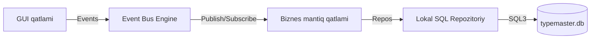

# ⌨️ Tezyoz (TypeMaster)

Windows uchun minimalist, oflayn rejimda ishlovchi professional tez terish trenajyori.

[](https://opensource.org/licenses/MIT)
[](https://python.org)
[](https://microsoft.com)
[](tests/)

---

## 💡 Concept & Values

**Tezyoz** – internet aloqasini talab qilmaydigan (100% lokal), Monkeytype va modern minimalist dizayndan andoza olgan kompyuterda tez yozish simulyatoridir. Dastur foydalanuvchining klaviatura mahoratini oshirish, kunlik motivatsiyani ko'taruvchi XP daraja tizimi, **17 ta marradan iborat yutuqlar (Achievements) tizimi**, zaif tugmalarni aniqlovchi **Aqlli Mashq (Smart Adaptive Practice)** va batafsil jismoniy klaviatura barmoq yordamchisini taqdim etadi.

---

## ⚡ Asosiy Imkoniyatlar (Key Features)

| Funksiya | Natija / Imkoniyati | Texnik yechim |
| :--- | :--- | :--- |
| **Aqlli Mashq (Smart Adaptive)** | Foydalanuvchi ko'p xato qiladigan tugmalarni tahlil qilib, unga moslashtirilgan aqlli matn mashqini yaratadi | Multi-key error frequency analyzer & generator |
| **17 ta Yutuqlar (Achievements)** | Tezlik (WPM), mashqlar soni, streak uzluksizligi, Smart Practice va darajalar bo'yicha 17 ta marra | SQLite transactional achievement evaluation engine |
| **Uch Tilli i18n Interfeys** | O'zbek (`uz`), Ingliz (`en`) va Rus (`ru`) tillarida to'liq interfeys, sozlamalar va bildirishnomalar | Dynamic i18n translation service |
| **UI Font Scaling (16pt-18pt)** | Katta yoshdagilar va o'qishga qulaylik uchun ultra-ravshan qalin (bold) shriftlar va optimal tugma o'lchamlari | Dynamic Theme & Typography Engine |
| **Visual Hands Tutor** | Real vaqtda qaysi barmoq va klavishni bosish kerakligini interaktiv ko'rsatish | Tkinter Canvas yordamida qo'llar simulyatsiyasi |
| **JCUKEN & QWERTY Qo'llab-quvvatlash** | Mashq darsida klaviatura tugmalarini dinamik ruscha JCUKENga hamda lotincha QWERTYga o'tkazish | Kirill/Lotin harf-jismoniy klavish xaritalash algoritmi |
| **Event Bus Arxitekturasi** | Event-driven UI va xizmatlar o'rtasida bo'sh bog'liqlik (decoupling) | Centralized EventBus pattern (`app/event_bus.py`) |
| **3x3 Results Grid** | Net WPM, Raw WPM, Aniqlik, Ritm va Jami bosilgan belgilar doimo aniq tartibda | Symmetrik 3x3 to'rli Natijalar paneli |
| **Off-line Analytics** | Yutuqlar chiziqli grafigi, foydalanish vaqti, zaif klavishlar issiqlik diagrammasi | Line/Bar charts & Interactive Heatmap Canvas |
| **Gamification Core** | XP yig'ish, darajalar (Level 1-20+), streak hisobi va kunlik topshiriqlar paneli | SQLite & Local progressive formulas |

> 🔑 **Xavfsizlik:** PBKDF2-HMAC-SHA256 (100k iteratsiya) algoritmi yordamida parollar lokal shifrlanadi.
> 🔊 **Auditoriya va Ovoz:** SoundService orqali dinamik audio toggle va tovush effektlari sozlamalari.

---

## 🛠️ Tizim Arxitekturasi (System Engine)

Tezyoz modulli, oson kengayuvchi va unit-testlashga qulay **Layered & Event-Driven Architecture** arxitekturasida yozilgan:



### Papka Tuzilishi
- `app/` — Dasturning GUI boshlang'ich nuqtasi (`application.py`), `event_bus.py` va sozlamalar.
- `database/` — Ma'lumotlar bazasi relyatsion sxemasi (`schema.py`) hamda repository klasterlari.
- `services/` — Auth seansi, i18n tarjima xizmati (`i18n_service.py`), yutuqlar (`achievements_service.py`), ovoz (`sound_service.py`).
- `engine/` — WPM / Aniqlik hisoblagichlar hamda typing simulyator mashinasi.
- `ui/` — Ekranga yuklanadigan visual CustomTkinter/Tkinter darchalari, jumladan `keyboard_visualizer.py`.
- `charts/` — Canvas yordamida chizilgan progress jadvallari, heatmap rendereri.
- `tests/` — Loyiha ishonchliligini ta'minlovchi 196 ta to'liq avtomatlashtirilgan unit-testlar.

---

## 🚀 Texnik O'rnatish va Sozlash (Run Deck)

### Minimal Talablar:
- Windows 8 / 10 / 11.
- Python 3.8+ versiyasi.

### Bosqichma-bosqich yuritish:

```powershell
# 1. Loyihani yuklab oling (Clone)
git clone https://github.com/Valijon21/Tezyoz.git
cd Tezyoz

# 2. Virtual muhitni tayyorlang va ishga tushiring
python -m venv .venv
.venv\Scripts\Activate.ps1

# 3. Kerakli kutubxonalarni yuklang
pip install -r requirements.txt

# 4. Dasturni ishga tushiring
python main.py
```

### 🚦 Test Verifikatsiyasi

Dasturning barcha visual va logic qismlari 196 ta avtomatlashtirilgan testlar to'plami bilan to'liq qoplangan:

```powershell
python -m unittest discover -s tests
```

---

## 👨‍💻 Dasturchi va Aloqa

- **Dasturchi:** Valijon Ergashev
- **Telefon:** [+998 (77) 342-33-21](tel:+998773423321)
- **Xizmatlar:** Telegram botlar, CRM tizimlar va Biznesni avtomatlashtirish uchun dasturlar tuzib beramiz.
- **Telegram:** [https://t.me/valijon2107](https://t.me/valijon2107)

---

## 📄 Litsenziya
Ushbu dastur MIT Litsenziyasi ostida ochiq manba etib belgilangan.
