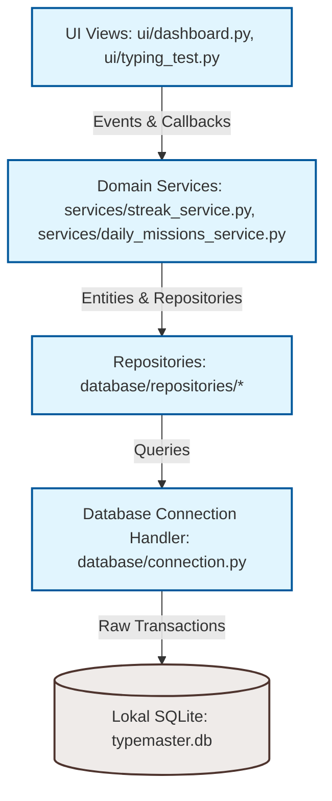

# Tezyoz (TypeMaster)

[](https://opensource.org/licenses/MIT)
[](https://python.org)
[](https://microsoft.com)

**Tezyoz (TypeMaster)** – bu Windows platformasi uchun mo'ljallangan, tarmoqqa ulanishni talab qilmaydigan (100% oflayn) professional kompyuterda tez yozish trenajyori. Monkeytype (Sokin Neon uslubi) minimalist estetikasidan ilhomlangan ushbu dastur mustaqil ravishda uzoq muddatli yozish faoliyatini tahlil qilish, tajriba ballari (XP), darajalar, kunlik topshiriqlar va lokal statistikani kuzatish imkonini beradi.

---

## 🚀 Asosiy Imkoniyatlar

*   **Minimalist Yozish Dvigateli**: Harakatlanuvchi kursor, so'zlarni jonli ravishda yoritish va real vaqtdagi validation hisoblagichlari (WPM tezligi, Aniqlik va Ritmik Consistency standart og'ishi).
*   **Klaviatura Yordamchi Tizimi (Visual Hands Tutor)**: Har bir belgi yoki son uchun to'g'ri barmoqni real vaqtda ko'rsatuvchi interaktiv Tkinter Canvas qo'llar guide-tizimi (sozlamalardan yoqish/o'chirish imkoniyati bilan).
*   **Rus Tili (JCUKEN) Tartibi**: Mashq tili Rus tili qilib tanlanganda, jismoniy klaviatura o'rnida dinamik ravishda kirill klavishlarini va ularning joylashuvini ko'rsatish.
*   **Kengaytirilgan Natijalar To'ri (3x3 Grid)**: Har bir mashq yakunida ko'rsatkichlarni visual tarzda taqdim etuvchi 9 ta karta: Net WPM, Raw WPM, Aniqlik, Ritm, Ritm Bahosi, Xatolar soni, Sarflangan vaqt, XP/Daraja, hamda jismoniy yozilgan **Jami belgilar**.
*   **Kuchli Analitika Dashboardi**: Quyidagi canvas-asosidagi vizual grafik va tahlillarni taqdim etadi:
    *   WPM/Aniqlik rivojlanish chiziqli diagrammasi (Line charts).
    *   Haftalik mashq davomiyligi ustunli diagrammasi (Bar charts).
    *   **Faol Klaviatura Heatmap** (klavishlar bosilish chastotasi va xatolik darajasi xaritasi).
*   **Gamifikatsiya va Rivojlanish**:
    *   Matn tergan sari ortib boruvchi tajriba ballari (XP) tizimi.
    *   Ajoyib ovoz effekti bilan daraja oshishi (Level Up) hamda interaktiv taraqqiyot panellari (XP va Kunlik Maqsad vizualizatsiyasi).
*   **Kunlik Topshiriqlar (Daily Missions)**: Har kuni yangilanadigan, foydalanuvchiga bonus XP beruvchi avtomatik topshiriqlar (masalan: ma'lum bir tezlik ko'rsatkichi, xatosiz matn terish).
*   **Zaxiralash Tizimi (Backup & Restore)**: Transactional SQLite ma'lumotlar bazasini import/eksport qilish va strukturani tekshirish vositasi.
*   **Moslashuvchan Mavzular Engine**: Ekran ko'rinishlarini bir zumda o'zgartiruvchi neon to'q (`dark`), oq (`light`) va `cyberpunk` rang ganalari.
*   **Ko'p tilli interfeys (i18n)**: Ingliz va O'zbek tillari o'rtasida dinamik boshqaruv.
*   **Oyna va Jadvallar Tekisligi**: Decimal nuqtalar va rekordlarning siljib ketmasligini ta'minlovchi o'ng tomonga tekislangan (anchor='e') tarix va rekordlar jadvallari.

---

## 🏗️ Arxitektura va Komponentlar Dizayni

Tezyoz modullarni alohida testlash va kengaytirishni osonlashtirish uchun **qatlamli arxitektura** (layered architecture) prinsiplariga tayanadi:



### Papka tuzilishi (Module Structure)

```text
typing/
│
├── app/                  # Ilova yuklanishi va asosiy sozlamalari
│   ├── application.py    # GUI darchasi lifecycle va View Router
│   └── config.py         # Markaziy sozlamalar va doimiy o'zgaruvchilar
│
├── database/             # Ma'lumotlarga kirish qatlami (Data access)
│   ├── connection.py     # SQLite ulanish va tranzaksiya boshqaruvchisi
│   ├── schema.py         # Relyatsion jadvallar va databaza migratsiyalari
│   └── repositories/     # Repozitoriy obyektlari (tarix, rekordlar, sozlamalar)
│
├── services/             # Biznes mantiq qatlami (Domain logic)
│   ├── auth_service.py   # Foydalanuvchi seanslari, shifrlash (PBKDF2-HMAC-SHA256)
│   ├── streak_service.py # Kunlik faollik va zanjir (streak) hisobi
│   ├── daily_missions_service.py # Kunlik topshiriqlar yaratish vositasi
│   ├── i18n_service.py   # Tarjima va ko'p tilli lug'atlar dvigateli
│   └── sound_service.py  # Tugmalar chertilishi va daraja oshishi tovushlari
│
├── engine/               # Matematik yadrolar va yozish dvigateli
│   ├── calculators.py    # WPM, aniqlik va ritm hisoblash formulalari
│   ├── typing_engine.py  # Mashq holatlari boshqaruvi (State Machine)
│   └── text_loader.py    # Matnlarni yuklash va resurslar menejeri
│
├── ui/                   # CustomTkinter va Tkinter grafik qismlari
│   ├── base.py           # Standard BaseView sarlavhasi
│   ├── dashboard.py      # Bosh panel grafiklari va interaktiv kartalar
│   ├── typing_test.py    # Matn terish maydoni va vizual yordamchi integratsiyasi
│   ├── keyboard_visualizer.py # Barmoq va jismoniy klaviatura simulyatori
│   ├── settings.py       # Sozlamalar paneli (tovushlar, shriftlar, mavzular)
│   └── theme.py          # Rang palitralari boshqaruvi
│
├── charts/               # Grafik chizish komponentlari
│   ├── line_chart.py     # Rivojlanish tahlillari chiziqli grafigi
│   ├── bar_chart.py      # Matn mashqi davomiyligi ustunlari
│   └── heatmap.py        # Heatmap klaviatura chastotalari va xatolar xaritasi
│
└── tests/                # Avtomatlashtirilgan testlar to'plami
    ├── test_database.py       # Tranzaksiyalar testlari
    ├── test_keyboard_visualizer.py # Visual hands va klaviatura testlari
    └── test_results_ui.py     # 3x3 natijalar to'lanishi testlari
```

---

## 🛠️ O'rnatish va Sozlash (Installation)

### Tizim Talablari
*   **Python**: 3.8 yoki undan yuqori talab qilinadi.
*   **Operatsion Tizim**: Windows 8 / 10 / 11.
*   **Kutubxonalar**: Standart Python kutubxonalariga qo'shimcha ravishda faqat modern visual uchun CustomTkinter foydalanilgan.

### O'rnatish tartibi:

1.  **Omborni yuklab oling (Clone)**:
    ```powershell
    git clone https://github.com/Valijon21/Tezyoz.git
    cd Tezyoz
    ```

2.  **Virtual muhit yaratish (venv)**:
    ```powershell
    python -m venv .venv
    ```

3.  **Virtual muhitni faollashtirish**:
    *   **PowerShell**:
        ```powershell
        .venv\Scripts\Activate.ps1
        ```
    *   **CMD**:
        ```cmd
        .venv\Scripts\activate.bat
        ```

4.  **Kutubxonalarni o'rnatish**:
    ```powershell
    pip install -r requirements.txt
    ```

---

## 🚦 Tizimni Ishga Tushirish va Sinab Ko'rish

### Dasturni yurgizish
Bootstrapper zanjirini boshlash uchun quyidagi buyruqni bering:
```powershell
python main.py
```

### Avtomatlashtirilgan testlarni ishga tushirish
Tezyoz platformasi barqarorligini tekshirish uchun unittest yordamida barcha unit-testlarni (jami 186+) ishdan o'tkazishingiz mumkin:
```powershell
python -m unittest discover -s tests
```

---

## 👥 Muallif va Aloqa (Developer & Contacts)

*   **Dastur muallifi**: Valijon Ergashev
*   **Telefon**: [+998 (77) 342-33-21](tel:+998773423321)
*   **Loyiha ta'rifi**: Tezyoz (TypeMaster) – boy o'zbek tili lug'atlar majmuasi bilan birgalikda foydalanuvchilarning klaviaturada ishlash mahoratini oshirish uchun yaratilgan to'liq professional trenajyor.

---

## 📄 Litsenziya
Ushbu loyiha MIT litsenziyasi ostida taqdim etilgan – batafsil ma'lumot olish uchun [LICENSE](LICENSE) faylini ko'ring.
