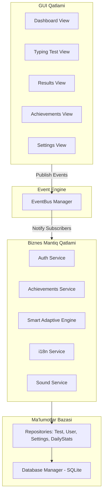

<div align="center">

# ⌨️ Tezyoz (TypeMaster)

**Windows uchun modern, oflayn, yuqori unumdorlikka ega tez yozish trenajyori va klaviatura mahorati platformasi.**

[](https://opensource.org/licenses/MIT)
[](https://python.org)
[](https://microsoft.com)
[](tests/)
[](#-uch-tilli-interfeys-i18n)

---

</div>

## 💡 Konsepsiya va Loyiha Falsafasi

**Tezyoz (TypeMaster)** – bu 100% oflayn rejimda ishlaydigan, internet aloqasini talab qilmaydigan, o'zbek, ingliz va rus tillarini to'liq qo'llab-quvvatlovchi zamonaviy tez terish simulyatoridir. 

Monkeytype hamda ilg'or minimalist GUI dizayn prinsiplari asosida yaratilgan Tezyoz shunchaki oddiy matn terish dasturi emas, balki foydalanuvchining **xatolarini tahlil qiluvchi va aqlli moslashuvchi (Smart Adaptive Practice Engine)**, **17 ta bosqichli gamifikatsiya yutuqlari** hamda **vizual barmoq trenajyori**ga ega bo'lgan to'liq platformadir.

---

## ⚡ Asosiy Imkoniyatlar (Key Features)

### 🧠 1. Aqlli Mashq (Smart Adaptive Practice Engine)
Foydalanuvchi mashqlar davomida ko'p xato qiladigan klavishlarni avtomatik aniqlaydi va ushbu zaif tugmalardan iborat maxsus moslashtirilgan matn mashqini dinamik ravishda shakllantiradi.

### 🏆 2. Kengaytirilgan Gamifikatsiya va 17 ta Yutuqlar (17 Achievements)
Foydalanuvchining qiziqishi va motivatsiyasini oshirish uchun 17 ta maxsus marra (Achievement) va XP daraja tizimi integratsiya qilingan:
- **Tezlik (WPM):** *Boshlovchi Barmoqlar (40 WPM)*, *Tezlik Ustasi (60 WPM)*, *Super Tezlik (80 WPM)*, *Tezlik Qiroli (100 WPM)*, *Yashin (120 WPM)*
- **Mashqlar Soni:** *Birinchi Qadam (1)*, *Yozuvchi (10)*, *Doimiy Mashqchi (50)*, *Matn Ustasi (100)*
- **Uzluksizlik (Streak):** *Matonat (3 kun)*, *Muntazamlik (7 kun)*, *Mustahkam Iroda (14 kun)*, *Afsona (30 kun)*
- **Maxsus & Darajalar:** *Mukammallik (100% Aniqlik)*, *Aqlli O'quvchi (5 Smart Practice)*, *Tajribali (Level 5)*, *Tajribali Usta (Level 10)*

### 🔤 3. Ultra-Ravshan UI va Font Scaling (16pt-18pt)
Barcha yoshdagi foydalanuvchilar va ko'rishga qulaylik yaratish maqsadida universal typography tizimi yaratilgan. Barcha matnlar, tugmalar va ko'rsatkichlar **16pt-18pt bold (qalin)** shriftda ultra-ravshan va jozibador formatda aks etadi.

### 🌍 4. Uch Tilli Interfeys (i18n)
Dasturdagi barcha oynalar, grafiklar, sozlamalar va bildirishnomalar 3 ta dilda bir zumda almashadi:
- 🇺🇿 **O'zbekcha (`uz`)**
- 🇬🇧 **Inglizcha (`en`)**
- 🇷🇺 **Ruscha (`ru`)**

### ⌨️ 5. Visual Hands Tutor & Layout Support
Real vaqt rejimida qaysi barmoq bilan qaysi klavishni bosish kerakligini interaktiv ko'rsatuvchi visual barmoqlar trenajyori. Ham **QWERTY (Lotin)**, ham **JCUKEN (Kirill/Rus)** klaviatura tartiblarini dinamik ravishda qo'llab-quvvatlaydi.

### 📊 6. Off-line Analitika va Heatmap
- **3x3 Symmetric Results Grid:** Net WPM, Raw WPM, Aniqlik, Ritm (Consistency), Xatolar va Jami belgilar.
- **Progress Grafiklari:** WPM va Aniqlik o'zgarishini ko'rsatuvchi interaktiv chiziqli va ustunli grafiklar.
- **Klaviatura Issiqlik Xaritasi (Heatmap):** Har bir tugmaning xatolar chastotasini ko'rsatuvchi Canvas renderer.

---

## 🛠️ Tizim Arxitekturasi (Architecture)

Tezyoz modulli, oson kengayuvchi va 100% testlanuvchan **Layered & Event-Driven Architecture** asosida qurilgan:



---

## 📁 Loyiha Tuzilishi (Project Structure)

```text
typing/
├── app/                  # Dasturni ishga tushirish (application.py, event_bus.py)
├── database/             # Relyatsion SQLite bazasi va repozitoriylar (schema.py, connection.py)
├── services/             # Biznes mantiq xizmatlari (i18n_service.py, achievements_service.py, sound_service.py)
├── engine/               # WPM, Aniqlik, Ritm va Smart Adaptive mashq dvigateli
├── ui/                   # CustomTkinter va Tkinter asosidagi barcha interfeys oynalari
├── charts/               # Interaktiv grafiklar va Klaviatsura Heatmap Canvas rendereri
├── gamification/         # Darajalar va XP hisoblash formulasining mantiqiy modullari
├── tests/                # 196 ta avtomatlashtirilgan unit-testlar to'plami
└── main.py               # Asosiy ishga tushirish fayli
```

---

## 🚀 O'rnatish va Ishga Tushirish (Run Deck)

### Tizim Talablari:
- **OS:** Windows 8 / 10 / 11 (64-bit)
- **Python:** 3.8 yoki undan yuqori

### Bosqichma-bosqich ko'rsatma:

```powershell
# 1. Repozitoriyani yuklab oling (Clone)
git clone https://github.com/Valijon21/Tezyoz.git
cd Tezyoz

# 2. Virtual muhit yaratish va aktivlashtirish
python -m venv .venv
.venv\Scripts\Activate.ps1

# 3. Zaruriy kutubxonalarni o'rnatish
pip install -r requirements.txt

# 4. Dasturni ishga tushirish
python main.py
```

### 🧪 Unit-Testlarni Yuritish (Verification)

Loyihadagi barcha biznes mantiq va UI funksiyalari **196 ta avtomatlashtirilgan unit-testlar** bilan 100% qoplangan:

```powershell
python -m unittest discover -s tests
```

---

## 👨‍💻 Dasturchi va Biznes Xizmatlari

<div align="center">

### **Valijon Ergashev**
*Software Engineer & Automation Specialist*

📞 **Telefon:** [+998 (77) 342-33-21](tel:+998773423321)  
💬 **Telegram Direct:** [@valijon2107](https://t.me/valijon2107)

---

#### 💼 Biz Taklif Qiladigan Professional Dasturlash Xizmatlari:
- 🤖 **Telegram Botlar:** Har qanday murakkablikdagi avtomatlashtirilgan botlar va Mini App'lar.
- 🏢 **CRM Tizimlar:** Biznesingiz uchun maxsus boshqaruv va hisobot platformalari.
- ⚙️ **Biznesni Avtomatlashtirish:** Kompaniya jarayonlarini soddalashtiruvchi oflayn va onlayn dasturlar.

*Agarda sizga ham sifatli va ishonchli dasturiy ta'minot kerak bo'lsa, xohlagan vaqtingizda bog'lanishingiz mumkin!*

</div>

---

## 📄 Litsenziya

Ushbu loyiha [MIT License](LICENSE) ostida ochiq manba etib belgilangan.
